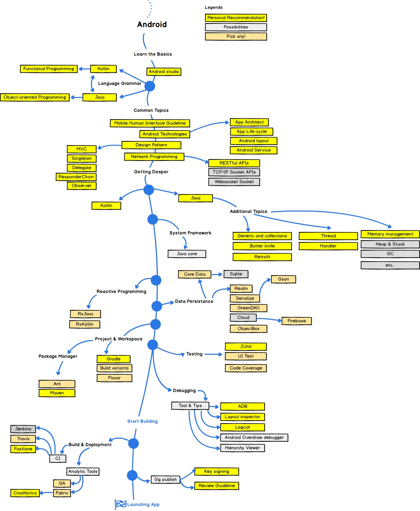

# Android Roadmap

## Courses

* [Android Developer Fundamentals Course][3]
* [Andvance Android Development][4]

## References

* [android roadmap][5]
* [Playing Video with VideoView][1]

[1]: https://google-developer-training.gitbooks.io/android-developer-advanced-course-practicals/content/unit-5-advanced-graphics-and-views/lesson-13-media/13-1-p-playing-video-with-videoview/13-1-p-playing-video-with-videoview.html "Playing video with VideoView"

[2]:https://github.com/google-developer-training/android-fundamentals "android fundamentals source code - github"
[3]:https://developer.android.com/courses/fundamentals-training/overview-v2 "Android Developer Fundamentals"
[4]:https://developer.android.com/courses/advanced-training/overview "Andvance Android Development"
[5]:https://github.com/tientnvn/android-developer-roadmap